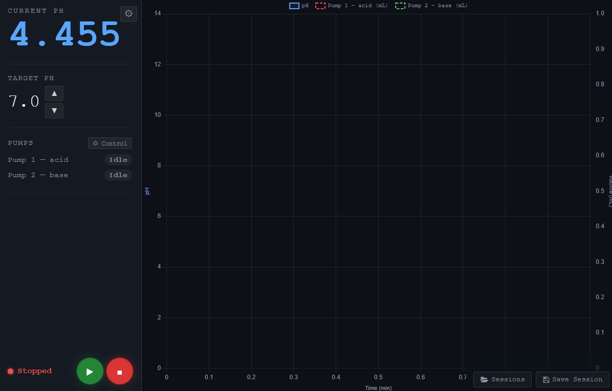
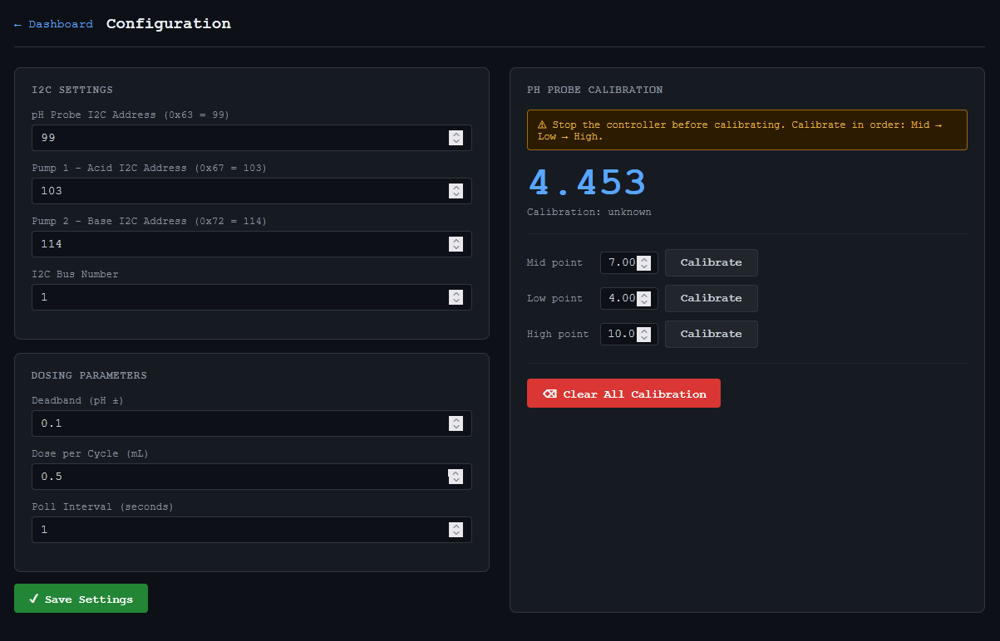

# pH Dosing Controller

Automated pH dosing system built on a Raspberry Pi using Atlas Scientific EZO-pH and EZO-PMP hardware.
Includes a full web dashboard, manual pump control, calibration wizards, and session logging.

---

## Screenshots

**Dashboard** — live pH readout, real-time chart, pump status, and session controls.



**Configuration** — I2C address settings, dosing parameters, and pH probe calibration.



---

## Video Guide

> **TODO:** Add video link here once published.

---

## Bill of Materials

| Qty | Component | Description | Link |
|---|---|---|---|
| 1 | Raspberry Pi 4 Model B | Main controller | [Amazon](https://www.amazon.com/Raspberry-Model-2019-Quad-Bluetooth/dp/B07TD42S27/) |
| 1 | Atlas Scientific EZO-pH Circuit | Embedded pH circuit | [Atlas Scientific](https://atlas-scientific.com/embedded-solutions/ezo-ph-circuit/) |
| 2 | Atlas Scientific EZO-PMP Kit | Peristaltic pump + EZO-PMP circuit (one acid, one base) | [Atlas Scientific](https://atlas-scientific.com/kits/ezo-pmp-kit/) |
| 1 | Atlas Scientific i3 Interlink | Electrical isolation between Pi and EZO circuits | [Atlas Scientific](https://atlas-scientific.com/electrical-isolation/i3-interlink/) |
| 1 | Hosyond Touchscreen | Capacitive touchscreen display for the Pi | [Amazon](https://www.amazon.com/Hosyond-Touchscreen-Compatible-Capacitive-Driver-Free/dp/B0D3QB7X4Z) |

> **Note:** The EZO-PMP requires two power supplies — 3.3–5.5 V for the control PCB (from the Pi) and 12–24 V for the motor.

---

## Enclosure

> **TODO:** STL and STEP files for a 3D-printed housing will be added in a future release.

---

## Hardware

| Component | Model | Default I2C Address |
|---|---|---|
| pH probe circuit | Atlas Scientific EZO-pH | `0x63` (99) |
| Acid pump (Pump 1) | Atlas Scientific EZO-PMP | `0x67` (103) |
| Base pump (Pump 2) | Atlas Scientific EZO-PMP | `0x72` (114) |
| Controller | Raspberry Pi 4 Model B | — |
| Display | Hosyond Capacitive Touchscreen | — |
| Isolation | Atlas Scientific i3 Interlink | — |

I2C addresses and dosing parameters are configurable via the web dashboard at `/config`.

---

## Project Structure

```
pHDoseingProject/
├── simple_ph_dosing_test.py      # Standalone CLI controller (no UI required)
└── ph_controller/
    ├── app.py                    # Flask app entry point
    ├── controller.py             # Background dosing loop
    ├── sensors.py                # pH sensor helper functions
    ├── config.py                 # Config load/save
    ├── config.json               # Runtime settings
    ├── STYLE.md                  # UI color token reference
    ├── hardware/
    │   ├── ezo_i2c.py            # Low-level Atlas Scientific EZO I2C driver
    │   └── pump.py               # High-level pump control helpers
    ├── routes/
    │   ├── dashboard.py          # Dashboard + session API routes
    │   ├── pump_routes.py        # Manual pump control API routes
    │   └── config_routes.py      # Config + pH calibration API routes
    ├── templates/                # Jinja2 HTML templates
    └── sessions/                 # CSV session logs (auto-created)
```

---

## Setup & Deployment

> **TODO:** Add full installation and deployment instructions here before release.
>
> Topics to cover:
> - OS and dependencies (`pip install flask`)
> - I2C enable on Raspberry Pi (`raspi-config`)
> - Wiring diagram
> - Running as a service / autostart via `start-atlasiot.sh`
> - Network access

---

## Using the Libraries in Your Own Scripts

All hardware drivers live in `ph_controller/hardware/`. You can import and use them
directly from any script in the project root without running the web app.

### EZO I2C Driver — `hardware/ezo_i2c.py`

Low-level driver for Atlas Scientific EZO modules over I2C.

```python
import sys
sys.path.insert(0, "ph_controller")

from hardware.ezo_i2c import EZOPH, EZOPump, scan_ezo_bus

# ── pH sensor ────────────────────────────────────────────────────
ph = EZOPH(address=99, bus=1)
reading = ph.read_ph()                  # float e.g. 6.842
reading = ph.read_ph_with_temp(22.5)   # with temperature compensation

# Calibration (always mid first)
ph.calibrate_mid(7.0)
ph.calibrate_low(4.0)
ph.calibrate_high(10.0)
ph.get_calibration_points()             # 0, 1, 2, or 3
ph.get_slope()                          # PHSlope(acid_pct, base_pct, zero_mv)
ph.clear_calibration()

ph.close()  # or use as context manager: with EZOPH(99) as ph:

# ── Pump ─────────────────────────────────────────────────────────
pump = EZOPump(address=103, bus=1)
pump.dispense(5.0)                      # dispense 5 mL
pump.dispense_continuous()             # run until stop()
pump.dispense_over_time(20.0, 5.0)    # 20 mL spread over 5 minutes
pump.dispense_at_rate(10.0, "*")       # 10 mL/min indefinitely
pump.stop()                            # stop immediately
pump.pause()                           # pause/resume toggle
pump.invert()                          # flip direction (retained across power cycles)
pump.calibrate(9.7)                    # store actual measured volume
pump.get_dispense_status()             # DispenseStatus(volume, pumping)
pump.get_pump_voltage()                # motor supply voltage in V
pump.wait_until_done(timeout=120)      # block until dispensing finishes

pump.close()

# ── Scan the I2C bus for EZO devices ─────────────────────────────
for addr, info in scan_ezo_bus(bus=1, start=97, end=112):
    print(f"0x{addr:02X}  {info.device_type}  fw {info.firmware}")
```

### Pump Helpers — `hardware/pump.py`

Thread-safe convenience wrappers used by the web app. Good starting point for simple scripts.

```python
import sys
sys.path.insert(0, "ph_controller")

from hardware import pump

ACID_ADDR = 103
BASE_ADDR = 114
BUS       = 1

pump.dose(ACID_ADDR, 1.5, BUS)                   # dispense 1.5 mL
pump.run_continuous(ACID_ADDR, reverse=False, bus=BUS)  # prime / run
pump.stop(ACID_ADDR, BUS)
pump.invert_direction(ACID_ADDR, BUS)             # toggle direction
pump.dispense_volume(ACID_ADDR, 10.0, BUS)        # for calibration
pump.calibrate_pump(ACID_ADDR, 9.7, BUS)          # store calibration
status = pump.get_status(ACID_ADDR, BUS)
# status = {"pumping": bool, "inverted": bool, "cal_status": int, "voltage": float}
```

### pH Sensor Helpers — `sensors.py`

```python
import sys
sys.path.insert(0, "ph_controller")

import sensors

ph = sensors.get_ph(address=99, bus=1)                   # float
sensors.calibrate_mid(7.0, address=99, bus=1)
sensors.calibrate_low(4.0, address=99, bus=1)
sensors.calibrate_high(10.0, address=99, bus=1)
sensors.clear_calibration(address=99, bus=1)
info = sensors.get_calibration_info(address=99, bus=1)
# info = {"points": int, "slope": {"acid_pct", "base_pct", "zero_mv"}}
```

### Standalone CLI Controller — `simple_ph_dosing_test.py`

Runs a full dosing loop from the command line with no web interface.
Useful for headless operation or testing without the UI.

```bash
python3 simple_ph_dosing_test.py --help
```

---

## REST API Reference

The web app exposes a JSON API at `http://<pi-ip>:8080`. Useful for integrating
with external systems or writing custom control scripts using `requests`.

### Dashboard

| Method | Endpoint | Body | Description |
|---|---|---|---|
| `GET` | `/api/status` | — | Full controller state (pH, pumps, history) |
| `POST` | `/api/target` | `{"target_ph": 7.0}` | Set target pH |
| `POST` | `/api/pump/start` | `{"name": "Tank_A"}` *(optional)* | Start / resume session |
| `POST` | `/api/pump/pause` | — | Pause dosing |
| `POST` | `/api/pump/stop` | — | Stop and close session |

### Sessions

| Method | Endpoint | Description |
|---|---|---|
| `GET` | `/api/sessions` | List all saved CSV session files |
| `GET` | `/api/sessions/<filename>` | Download a specific session CSV |

### Manual Pump Control

`<id>` is `1` (acid) or `2` (base).

| Method | Endpoint | Body | Description |
|---|---|---|---|
| `GET` | `/api/pump/<id>/status` | — | Pump state (pumping, direction, cal, voltage) |
| `POST` | `/api/pump/<id>/run` | `{"reverse": false}` | Run continuously (prime/flush) |
| `POST` | `/api/pump/<id>/stop` | — | Stop individual pump |
| `POST` | `/api/pump/<id>/invert` | — | Toggle direction |
| `POST` | `/api/pump/<id>/dispense` | `{"ml": 10.0}` | Dispense specific volume |
| `POST` | `/api/pump/<id>/calibrate` | `{"actual_ml": 9.7}` | Store volume calibration |

### Configuration & pH Calibration

| Method | Endpoint | Body | Description |
|---|---|---|---|
| `GET` | `/api/config` | — | Read current config |
| `POST` | `/api/config` | See config fields below | Update config |
| `GET` | `/api/calibrate/reading` | — | Current pH + calibration points + slope |
| `POST` | `/api/calibrate/mid` | `{"value": 7.0}` | Calibrate pH mid point |
| `POST` | `/api/calibrate/low` | `{"value": 4.0}` | Calibrate pH low point |
| `POST` | `/api/calibrate/high` | `{"value": 10.0}` | Calibrate pH high point |
| `POST` | `/api/calibrate/clear` | — | Clear all pH calibration |

**Config fields:** `ph_addr`, `pump1_addr`, `pump2_addr`, `i2c_bus`, `deadband`, `dose_ml`, `poll_sec`

### Session CSV Format

```
time,elapsed_min,ph,pump1_acid_ml,pump2_base_ml
2026-05-19 14:30:01,0.0,6.842,0.0,0.0
2026-05-19 14:30:03,0.033,6.839,0.0,0.5
...
```

---

## License

MIT License — Copyright (c) 2026 Latif

See [LICENSE](LICENSE) for the full text.